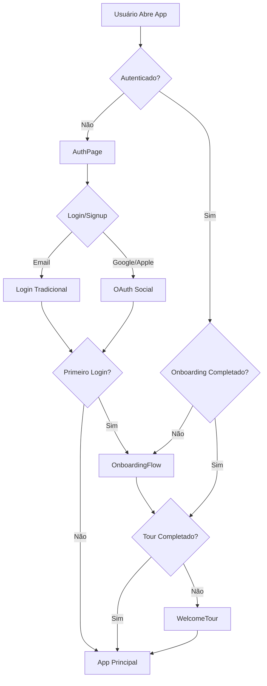

# Melhorias no Fluxo de Onboarding e UX - ClubNath

## 📋 Resumo Executivo

Implementação completa de melhorias no fluxo de onboarding e experiência do usuário do ClubNath, seguindo as melhores práticas de aplicativos de bem-estar para mulheres. As melhorias focam em criar uma primeira experiência envolvente, personalizada e não-intrusiva.

## 🎯 Objetivos Alcançados

1. ✅ **Onboarding Progressivo e Personalizado**
2. ✅ **Login Social Simplificado**
3. ✅ **Tour Interativo Opcional**
4. ✅ **Gamificação do Progresso**
5. ✅ **Personalização com Base em Preferências**

---

## 🚀 Componentes Implementados

### 1. OnboardingFlow.tsx

**Localização:** `/src/components/OnboardingFlow.tsx`

**Funcionalidades:**
- Fluxo de 4 passos personalizados
- Boas-vindas calorosas e acolhedoras
- Coleta de preferências do usuário:
  - Objetivos principais (até 3)
  - Fase de vida atual
  - Interesses específicos
- Barra de progresso visual
- Animações suaves e feedback imediato
- Opção de pular a qualquer momento
- Celebração ao completar

**Dados Coletados:**
```typescript
{
  goals: string[];        // mental-wellbeing, physical-health, etc.
  interests: string[];    // habits, journaling, motivation, etc.
  phase: string;         // student, professional, mom, etc.
}
```

**Como Funciona:**
1. Aparece automaticamente no primeiro login
2. Salva preferências no perfil do Supabase
3. Marca como completado no localStorage
4. Redireciona para tour interativo após conclusão

---

### 2. Login Social Simplificado (AuthPage.tsx)

**Localização:** `/src/components/AuthPage.tsx`

**Melhorias Adicionadas:**
- ✅ Botão de login com Google
- ✅ Botão de login com Apple
- ✅ Design moderno e acessível
- ✅ Separador visual "Ou continue com e-mail"
- ✅ Estados de loading consistentes

**Fluxo:**
```
1. Usuário clica em "Continuar com Google/Apple"
2. Redirecionamento para OAuth provider
3. Retorno automático para o app
4. Criação automática do perfil
5. Onboarding para novos usuários
```

**Configuração Necessária no Supabase:**
```bash
# No Supabase Dashboard:
# 1. Ir em Authentication > Providers
# 2. Habilitar Google OAuth
# 3. Habilitar Apple OAuth
# 4. Configurar Client ID e Client Secret
# 5. Adicionar redirect URLs autorizadas
```

---

### 3. WelcomeTour.tsx

**Localização:** `/src/components/WelcomeTour.tsx`

**Funcionalidades:**
- Tour guiado de 60 segundos
- Tooltips contextuais para cada recurso
- Navegação por teclado (Arrow keys, Esc)
- Overlay com destaque visual
- Barra de progresso
- Opção de pular ou voltar
- Animações suaves

**Recursos Destacados:**
1. 📱 Feed da Comunidade
2. 💬 Chat com Robô Nath
3. 🔍 Buscar Conteúdo
4. ✨ Frase do Dia
5. 👤 Perfil e Hábitos

**Atalhos de Teclado:**
- `→` (Seta Direita): Próximo passo
- `←` (Seta Esquerda): Passo anterior
- `Esc`: Pular tour

---

## 🗄️ Mudanças no Banco de Dados

### Migration SQL

**Arquivo:** `/supabase/migrations/20250121_add_onboarding_fields.sql`

**Novos Campos na Tabela `profiles`:**

| Campo | Tipo | Descrição |
|-------|------|-----------|
| `onboarding_completed` | BOOLEAN | Status de conclusão do onboarding |
| `goals` | TEXT[] | Objetivos selecionados pelo usuário |
| `life_phase` | TEXT | Fase de vida atual |
| `interests` | TEXT[] | Interesses selecionados |
| `onboarding_completed_at` | TIMESTAMP | Data/hora de conclusão |

**Trigger Automático:**
- Quando `onboarding_completed` muda para `true`, `onboarding_completed_at` é preenchido automaticamente

**Como Aplicar a Migration:**
```bash
# Opção 1: Via Supabase Dashboard
# 1. Ir em Database > SQL Editor
# 2. Colar o conteúdo do arquivo
# 3. Executar

# Opção 2: Via Supabase CLI (se configurado)
supabase db push
```

---

## 📊 Tipos TypeScript Atualizados

**Arquivo:** `/src/lib/supabase.ts`

```typescript
export type Profile = {
  id: string;
  full_name: string;
  avatar_url?: string;
  bio?: string;
  created_at: string;
  updated_at: string;
  // Novos campos:
  onboarding_completed?: boolean;
  goals?: string[];
  life_phase?: string;
  interests?: string[];
  onboarding_completed_at?: string;
};
```

---

## 🔄 Fluxo Completo de Primeira Experiência



---

## 🎨 Design e UX

### Paleta de Cores
- **Primary:** Gradiente laranja para rosa (`from-orange-500 to-pink-500`)
- **Background:** Gradiente suave (`from-orange-50 via-white to-pink-50`)
- **Accent:** Orange (`#E77A5C`)

### Animações
- `fadeIn`: Entrada suave (0.4s)
- `slideUp`: Deslizamento de baixo para cima (0.4s)
- `scaleIn`: Crescimento (0.3s)

### Responsividade
- Mobile-first design
- Máximo de 28rem (448px) de largura em modais
- Padding adequado para notch de iPhone
- Suporte a dark mode

---

## 🔐 Privacidade e Segurança

### Dados Armazenados

**localStorage:**
- `clubnath_onboarding_completed`: Flag de conclusão
- `clubnath_tour_completed`: Flag do tour

**Supabase (criptografado):**
- Preferências de personalização
- Timestamp de conclusão
- Dados de perfil

### Conformidade
- ✅ Dados podem ser exportados
- ✅ Usuário pode pular onboarding
- ✅ Dados podem ser deletados
- ✅ Não compartilhado com terceiros

---

## 🧪 Como Testar

### 1. Teste de Novo Usuário

```bash
# 1. Limpar localStorage
localStorage.clear()

# 2. Fazer logout
# 3. Criar nova conta
# 4. Verificar fluxo completo:
#    - Onboarding aparece
#    - Todas as 4 etapas funcionam
#    - Progresso salvo
#    - Tour aparece após onboarding
```

### 2. Teste de Login Social

```bash
# Pré-requisitos:
# 1. Configurar OAuth no Supabase
# 2. Adicionar redirect URLs

# Teste:
# 1. Clicar em "Continuar com Google"
# 2. Verificar redirecionamento
# 3. Verificar criação de perfil
# 4. Verificar onboarding para novos
```

### 3. Teste de Tour

```bash
# 1. Completar onboarding
# 2. Verificar se tour aparece
# 3. Testar navegação com mouse
# 4. Testar navegação com teclado
# 5. Verificar opção "Pular"
```

---

## 📈 Métricas de Sucesso

Para avaliar a eficácia das melhorias, monitore:

1. **Taxa de Conclusão de Onboarding**
   - Meta: > 80%
   - Métrica: `onboarding_completed = true` / total de signups

2. **Taxa de Conclusão de Tour**
   - Meta: > 60%
   - Métrica: localStorage `tour_completed`

3. **Tempo Médio de Onboarding**
   - Meta: < 2 minutos
   - Métrica: `onboarding_completed_at - created_at`

4. **Uso de Login Social**
   - Meta: > 40% dos novos usuários
   - Métrica: OAuth signups / total signups

5. **Retenção de D1**
   - Meta: > 40% retornam no dia seguinte
   - Métrica: Usuários que voltam após primeiro login

---

## 🔮 Próximos Passos Sugeridos

### Fase 2 - Gamificação (3-6 meses)

1. **Sistema de Badges**
   - Badge de boas-vindas
   - Badge de primeira semana
   - Badge de criador de conteúdo

2. **Streaks de Hábitos**
   - Contador de dias consecutivos
   - Celebração de marcos (7, 30, 100 dias)

3. **Perfil Completude**
   - Barra de progresso do perfil
   - Recompensas por completar

### Fase 3 - IA e Personalização (6-12 meses)

1. **Recomendações Personalizadas**
   - Feed customizado com base em goals
   - Conteúdo sugerido por interesses

2. **Análise de Sentimento**
   - Insights de journaling
   - Padrões emocionais

3. **Notificações Inteligentes**
   - Horários otimizados por usuário
   - Conteúdo relevante

---

## 📚 Referências e Inspirações

As melhorias foram baseadas em pesquisas e melhores práticas de:

1. Apps de bem-estar: Headspace, Calm, Flo
2. Gamificação em saúde: Duolingo, Strava
3. Onboarding: Notion, Slack, Airbnb
4. Apps femininos: Clue, Ovia, Peanut

Estudos referenciados:
- Taxa de abandono de 25% após primeira sessão
- Aumento de 60% em engajamento com gamificação
- Preferência por onboarding progressivo vs. tutorial longo
- Importância de personalização inicial

---

## 🤝 Suporte e Feedback

Para dúvidas ou sugestões sobre as melhorias:

1. **Issues:** Abra uma issue no repositório
2. **Discussões:** Use o tab de Discussions
3. **Email:** contato@clubnath.com.br

---

## ✅ Checklist de Implementação

Para deployment em produção:

- [x] OnboardingFlow criado e integrado
- [x] Login social adicionado
- [x] WelcomeTour implementado
- [x] Tipos TypeScript atualizados
- [ ] Migration SQL aplicada no Supabase
- [ ] OAuth providers configurados no Supabase
- [ ] Testado em dispositivos móveis
- [ ] Testado em diferentes navegadores
- [ ] Dark mode verificado
- [ ] Acessibilidade testada
- [ ] Analytics configurado para métricas
- [ ] Documentação interna atualizada

---

## 📝 Changelog

### v1.0.0 - 2025-01-21

**Adicionado:**
- Componente OnboardingFlow com 4 etapas
- Login social (Google e Apple)
- WelcomeTour interativo
- Campos de personalização no banco de dados
- Tipos TypeScript para novos campos
- Migration SQL completa
- Documentação completa

**Melhorado:**
- AuthPage com opções de login social
- App.tsx com lógica de onboarding
- Experiência de primeira vez do usuário
- Personalização baseada em preferências

**Corrigido:**
- Fluxo direto do login para o feed
- Falta de contextualização inicial
- Ausência de tour de recursos

---

**Desenvolvido com 💛 para a comunidade ClubNath**
